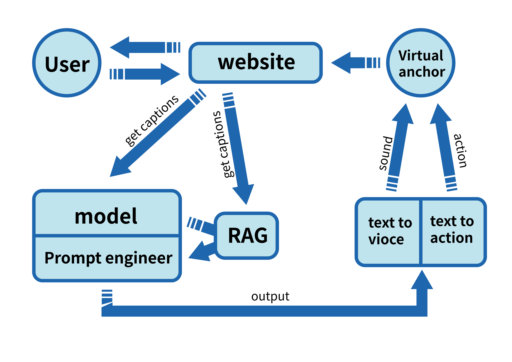

# Internlm

项目使用InternLM2.5模型，通过微调建立针对猫娘主播的认识，通过RAG来增加对最近发生事件的认知
待办：
1.进行微调训练
2.使用模型自动抓取近期大事件建立RAG数据库
3.文字转语音功能须完善
4.对话内容也需存入RAG数据库以实现大模型记忆
5.虚拟皮套人外壳制作
6.训练一套皮套运动方案来配合对话环境
7.经行模型剪枝达到无延迟对话
*8.进一步减小运行门槛实现本地部署，变成个人助理

基于 InternLM 的虚拟猫娘项目，欢迎大家也来参加书生大模型实战营项目（http://github.com/internLM/tutorial）